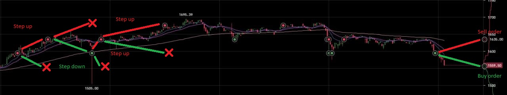
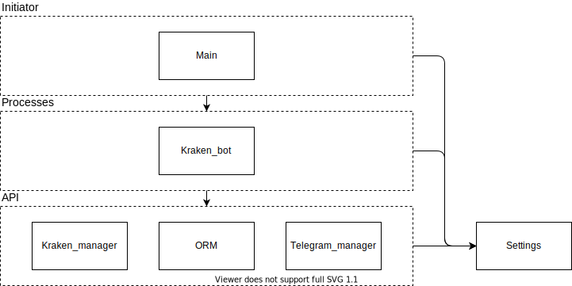

# What it does?
This is a cryptocurrency trading bot that sells coins on a pump and buys on a dump.
Here is a basic concept of how it works:
1. It places two limit orders: sell and buy.
1. When one of the orders is complete, it cancels another one and creates new orders around new price.

#### The example of a working bot with 2.5% price step:


# How does it work?
This bot uses following stack of technology:
1. Postgres database to manipulate strategies settings and store the state of the robot
1. SqlAlchemy package to create easy to use ORM for easier and safer DB manipulations
1. Krakenex package to get access to Kraken exchange API
1. Telegram bot package to notify about fulfilled orders and errors

#### Here is algorithms that describe how this bot works


#### Here is high level structure of python project with `import` relationships:


#### DB schema:


# How to run this beast?

## Prerequisites
You need a running database. I used database on postgres, you are free to change DBMS, just be sure it is 
supported by `sqlalchemy` and you added required package to requirements.txt

You can find sql scripts:
- `database/create.sql` - script to create all necessary tables
- `database/fill.sql` - script to add default strategies

## Run locally
1. Install python3
1. Install all requirements ```pip install -r requirements.txt```
1. Create `.env` file using `.env_example` as a reference. 
1. Run `main.py`:
```bash
python main.py
```

## Run docker container
You can build your own docker container.
Just run following commands from root repo folder:
```bash
docker build -f Dockerfile -t [docker_hub_user]/[repo_name]:volatobot_v1 .
docker push [docker_hub_user]/[docker_repo_name]:volatobot_v1
```

To run container use the following command template:

```bash
docker run -d --restart unless-stopped \
--env db_settings=[your_database_url] \
--env kraken_api_key=[your_kraken_api_key] \
--env kraken_private_api_key=[your_kraken_private_api_key] \
--env telegram_api_key=[your_chat_bot_api_key] \
--env telegram_chat_id=[chat_id_in_your_telegram_bot_to_send_notifications] \
[docker_hub_user]/[docker_repo_name]:volatobot_v1
```
